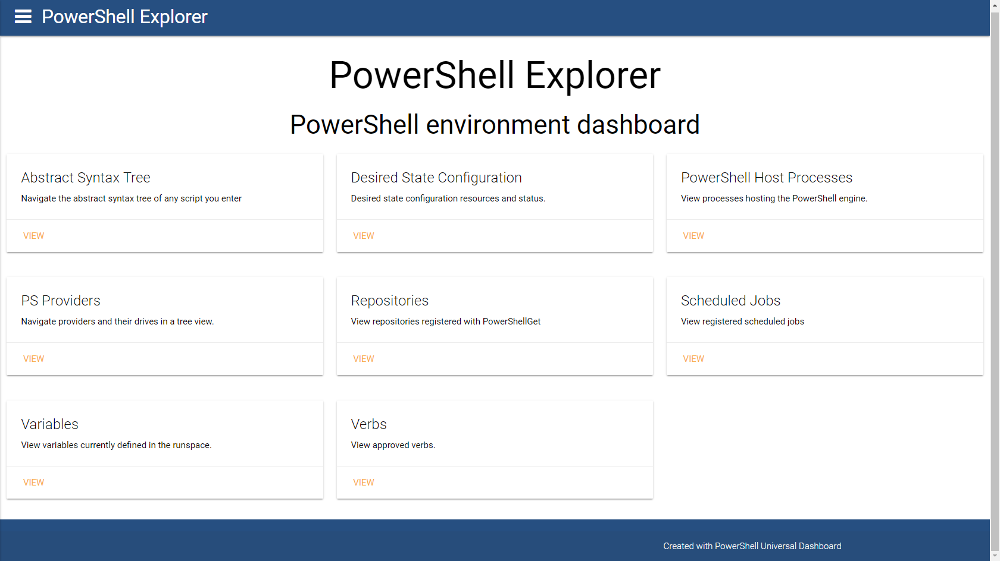
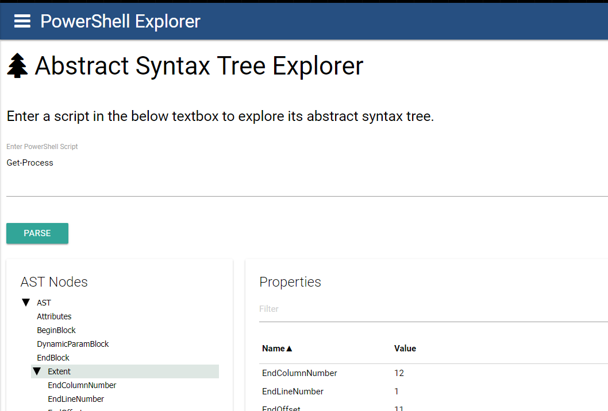
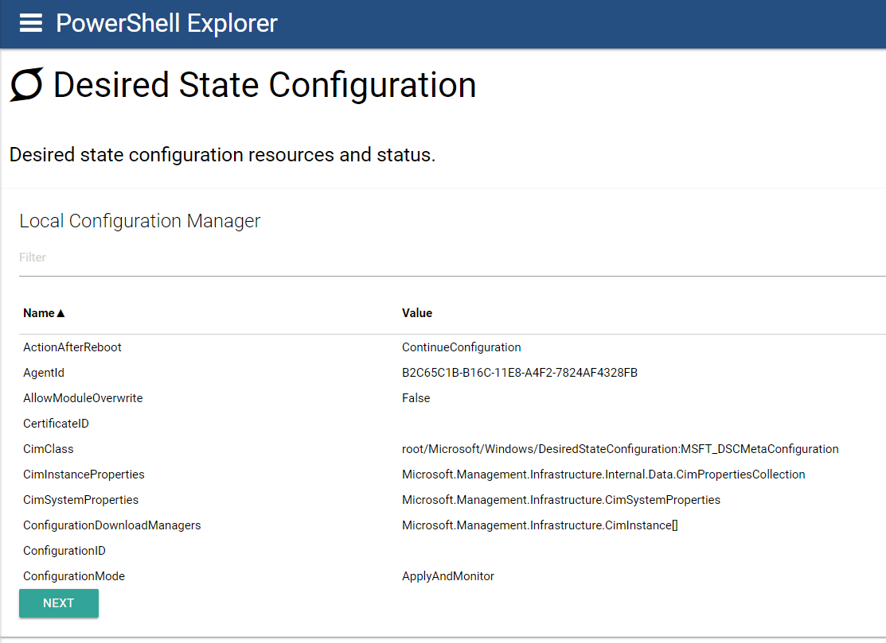
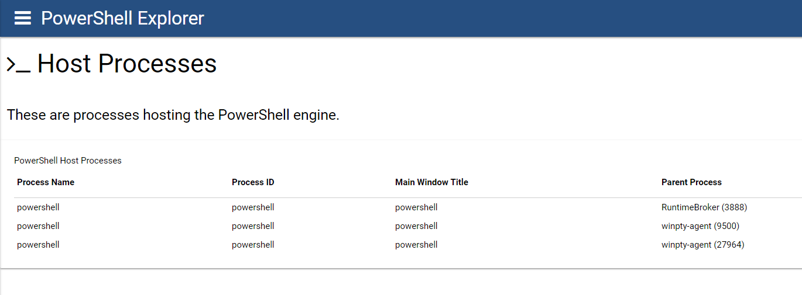
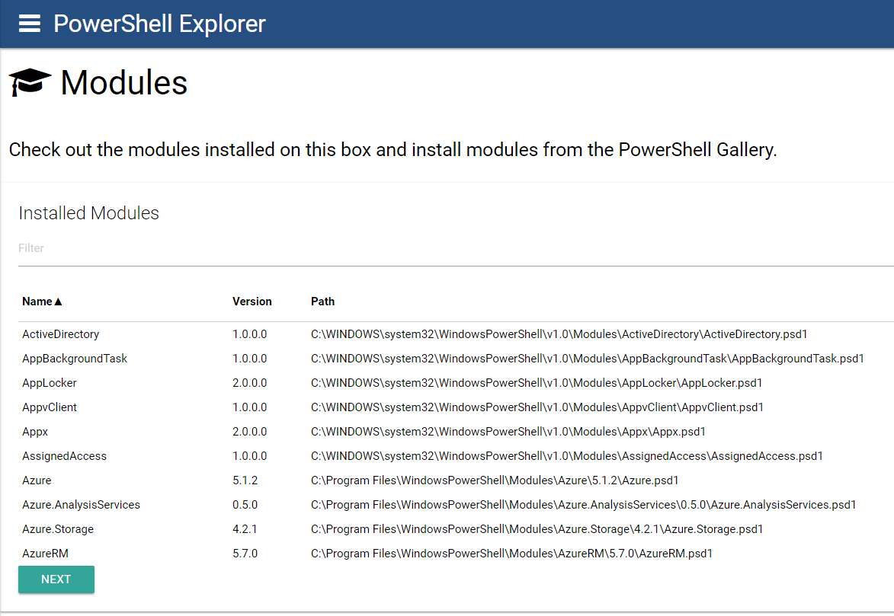
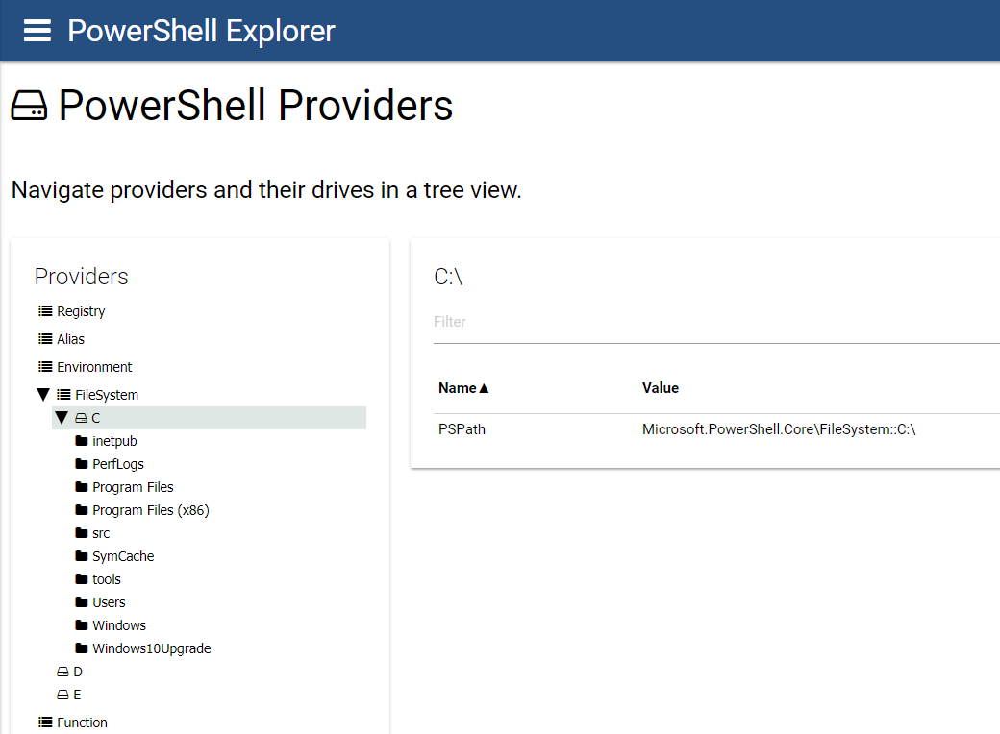
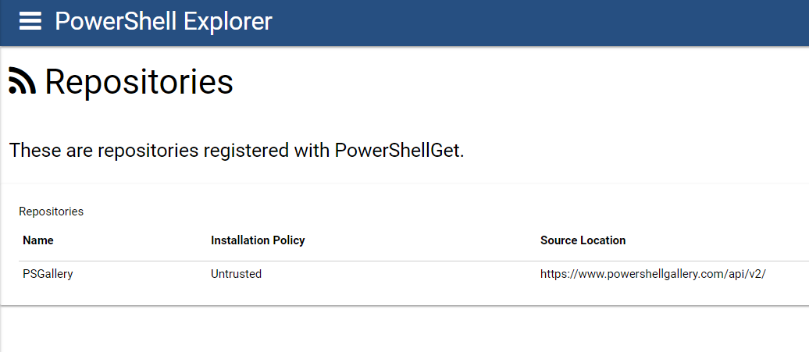
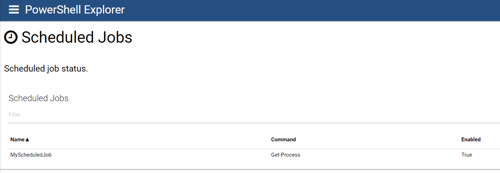
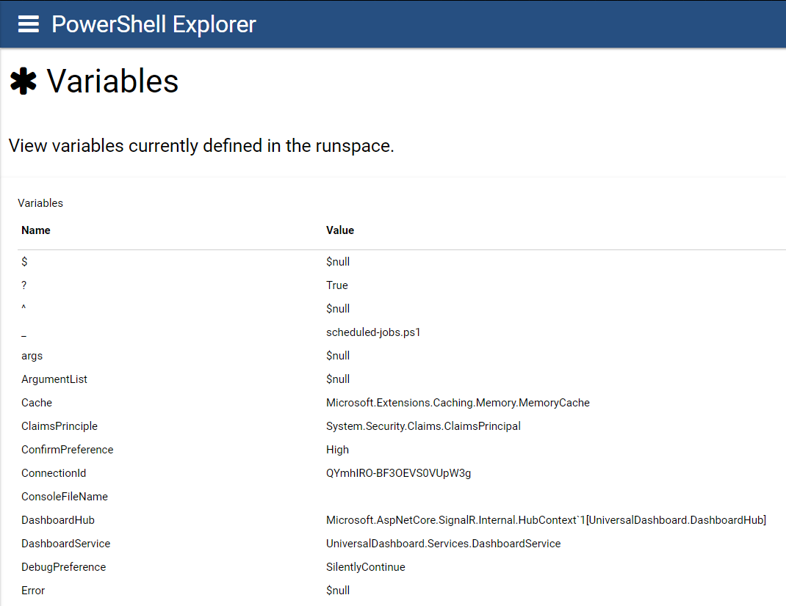

# ud-powershellexplorer
PowerShell Explorer shows information about the PowerShell environment on your machine.



## Installation 

```powershell
Install-Module PowerShellExplorer
```

## Features

### Abstract Syntax Tree Navigation 

Enter a script and then navigate the AST of that script.



## Desired State Configuration 

View the local configuration manager properties and local resources. 



## Host Processes

View processes hosting the PowerShell engine on your machine.



## Modules 

View installed modules and install new modules from the PowerShell Gallery. 



## Providers

Navigate PowerShell providers and their items. 



## Repositories

View the registered PowerShellGet repositories.



## Scheduled Jobs

View registered scheduled jobs. 



## Variables

View variables defined in the current runspace. 

